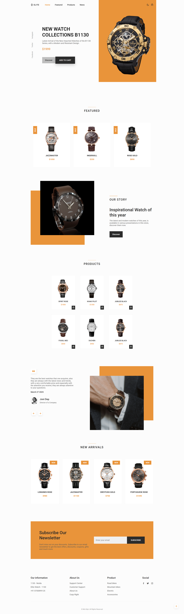
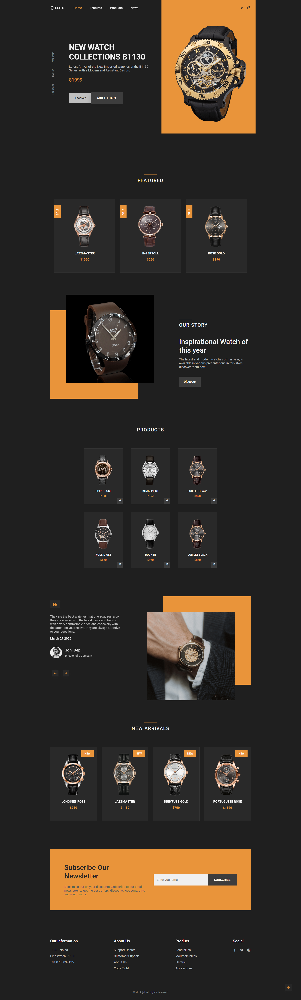

# **Elite Watch**
A Fully Responsive Watch Website Crafted to Deliver a Premium Online Shopping Experience.
With a Minimalist Black & White Theme and Sleek Product Showcases, this Project Focuses on Providing a Luxurious, Fast-Loading and Engaging User Journey for Watch Enthusiasts.

## Project Overview
- **Elite Watches is a concept-based Website I built to enhance my Frontend Development Skills and Learn Practical Deployment Techniques.
  My Vision was to Create a Platform that could Easily Represent a Real E-Commerce Brand with Security , Scalability and Performance in Mind.**

## Tech Stack
- **HTML | CSS | JavaScript | Swiper.js | Netlify (PaaS) | HSTS Security Headers | jsDelivr CDN**

## Features 
- ** External Libraries Optimized via jsDelivr CDN**
- ** Product Slider Integration Using Swiper.js for Smooth Navigation**
- ** Clean & Scalable HTML , CSS and JS Structure for Future Expansion**
- ** Responsive UI that Works Seamlessly on Mobile, Tablet and Desktop**

## Future Improvements
- **Improved My Knowledge of Secure Deployment Practices**
- **Learned Performance Optimization with CDN & JS Libraries**
- **Hands-On Experience with Hosting & SSL Management on Netlify**

## 📸Screenshots

Below is a Preview of **Elite Watch**, Showcasing the Layout and Styling implemented Using pure HTML , CSS and Javascript. 
The Design focuses on Clean Structure, Responsiveness and Modern Styling.

- **Dark Theme**

- **Light Theme**

